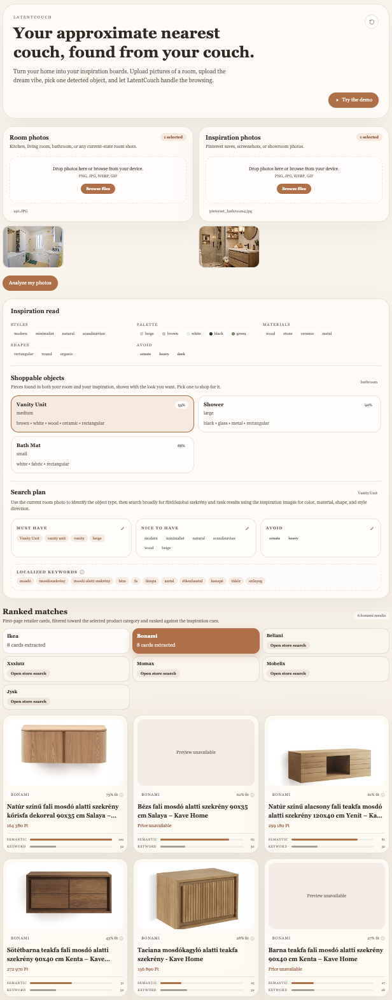

# latentcouch

*Your approximate nearest couch, found from your couch.*

latentcouch turns your own room into a shopping query. You upload photos of a room plus a
few inspiration shots; a vision-language model extracts the furniture and the target
aesthetic, the app searches a handful of European retailers, and a multi-stage ranker
returns the first-page product cards that best match the vibe.



This started as my first vibe-coded project — an experiment in how far LLM tooling can take
a rough idea end to end. The motivating pain was real: after moving into a new apartment I
needed a lot of furniture and didn't want to hand-search a dozen retailer webshops.

## How it works

The pipeline is intentionally linear, one step per API route (all under `app/api/`):

1. **`analyze-room`** — room photos → detected furniture objects with attributes
   (color, material, shape, size), as structured JSON.
2. **`analyze-inspiration`** — inspiration photos → an "aesthetic profile" (style keywords,
   palette, materials, shapes, avoids) **and** the furniture objects visible there, each
   carrying the *desired* attributes.
3. **Shoppable objects (client-side)** — the room and inspiration objects are intersected by
   canonical furniture category (`intersectShoppableObjects` in `lib/shopping-taxonomy.ts`),
   keeping only pieces present in both — and shown with the *inspiration's* attributes. The
   point: you shop for the look you want on items you own, not for what's already in the room.
4. **`plan-search`** — the selected (inspiration) object + aesthetic profile → a `SearchPlan`:
   object category, a broad query, must-have / nice-to-have / avoid cues, and per-retailer
   queries.
5. **`search-products`** — runs the retailer adapters (headless Chromium via Playwright),
   then ranks the scraped candidates (see below) and returns the top matches.

The analysis steps use the OpenAI Responses API with Zod-schema structured outputs
(`responses.parse` + `zodTextFormat`), so every model response is validated against the
same schemas the API and UI share (`lib/types.ts`).

## Ranking pipeline

Scraped product cards pass through three stages, each populating a `scoreBreakdown` so the
contributions stay inspectable (`lib/ranking/`, `lib/openai/rerank-products.ts`):

1. **Lexical scorer** (`rank-candidates.ts`) — token-overlap and category matching between
   the plan's cues and each candidate's title/attributes. It is already cross-lingual via a
   hand-built EN→HU glossary in `lib/shopping-taxonomy.ts` (the retailers are Hungarian).
2. **Dense-retrieval reranker** (`embedding-rerank.ts`) — mean-pooled, L2-normalized
   sentence embeddings of the query document and each candidate, produced **locally** by a
   multilingual model (default `Xenova/multilingual-e5-small`) running in-process through
   Transformers.js / onnxruntime — no API, no per-call cost. Scores are min-max-normalized
   cosine similarities, linearly blended with the lexical score. This is what matches
   English inspiration cues against Hungarian product titles that share no tokens.
3. **LLM reranker** (`rerank-products.ts`, optional) — a final vision-aware pass over the
   shortlist when an `OPENAI_API_KEY` is set; skipped cleanly otherwise.

Each product card surfaces the **Semantic** (embedding) vs **Keyword** (lexical)
contribution so the reranker's effect is visible.

**Operational note.** The embedding model depends on `onnxruntime-node`, whose native
binary must match the Node architecture (arm64). The reranker is therefore **opt-in on the
server** (`RERANK_EMBEDDINGS=1`) and lazily `import()`-ed, so the native module never loads
during `next build` and an x64/Rosetta runtime can't crash the server — it simply falls back
to lexical + the optional LLM pass. The eval harness calls the reranker directly regardless.

### Evaluating the reranker

`lib/ranking/eval/sample.json` is a small labeled set (graded relevance) with several
relevant items whose titles are Hungarian-only — exactly where token overlap fails and
dense retrieval should win. The harness compares lexical-only vs embedding-only vs blend on
nDCG@5, P@3, and MRR:

```bash
pnpm eval:rerank                                  # default model
EMBEDDING_MODEL=Xenova/bge-m3 pnpm eval:rerank    # heavier model
```

First run downloads the model (~110 MB, cached) and needs an arm64 Node. The question it
frames: do learned multilingual embeddings beat a curated keyword glossary? The baseline is
deliberately strong because the lexical scorer is already glossary-augmented — extend the
dataset with real scrapes to sharpen the read-out.

## Stack

Next.js (App Router) · TypeScript · Tailwind CSS · Zod · OpenAI SDK (Responses API) ·
Playwright · Transformers.js (`@huggingface/transformers`) · onnxruntime.

## Local development

```bash
pnpm install
pnpm exec playwright install chromium
cp .env.example .env.local        # add OPENAI_API_KEY for the live pipeline
pnpm dev
```

The demo works with no keys. The live "Analyze my photos" flow needs `OPENAI_API_KEY`; see
`.env.example` for the optional model/reranker/capture flags.

## Deployment (Vercel)

Standard Next.js deploy. The demo path is fully client-side, so **no secrets are required**
to ship it.

1. Push to GitHub and import the repo in the Vercel dashboard (framework auto-detected).
2. Optional env: `OPENAI_API_KEY` for the live analysis routes;
   `PLAYWRIGHT_SKIP_BROWSER_DOWNLOAD=1` at build time to skip the Chromium download.
3. Deploy — the **"Try the demo"** button works immediately.

## Current state & limitations

- **Retailer coverage.** Only **IKEA** and **Bonami** are scraped live. Beliani and JYSK are
  deferred, and the Austrian chains (XXXLutz, Mömax, Möbelix) bot-gate headless traffic — all
  five are stubbed to return a manual store-search link, surfaced as per-store statuses in the
  UI rather than failing the request.
- **Serverless scraping.** Playwright/Chromium can't run on serverless functions, so on
  Vercel the search step degrades to the plan plus "couldn't fetch" statuses. Live scraping
  runs locally or on a container host with a real browser; the deployed showcase is the demo.
- **Scraping is best-effort.** The extractor pulls first-page product-link anchors with a
  generic card heuristic; per-store selectors are isolated config points because markup drifts.

## Demo mode & regenerating the fixture

The **"Try the demo"** button loads a captured session from `lib/demo/fixture.json` entirely
client-side (no API, no scraping), so the deployed app is instant and free. To recapture:

1. Set `NEXT_PUBLIC_ENABLE_DEMO_CAPTURE=1` in `.env.local` and run `pnpm dev`.
2. Run a real session (upload photos, pick an object, let it scrape).
3. Click **"⬇ Save demo fixture"** and save the download over `lib/demo/fixture.json`.

## Project layout

```text
app/
  api/                 route handlers: analyze-room, analyze-inspiration, plan-search, search-products
  page.tsx             single-page flow + client state
components/            upload, object selector, search-plan card, results grid, product card
lib/
  types.ts             Zod schemas (RoomObjects, Inspiration, SearchPlan, ProductCandidate)
  shopping-taxonomy.ts furniture taxonomy, EN↔HU glossary, room∩inspiration intersection
  openai/              vision analysis, planning, LLM reranker (Responses API)
  ranking/
    rank-candidates.ts lexical scorer
    embedding-rerank.ts local multilingual dense reranker
    metrics.ts         nDCG / precision@k / MRR
    eval/sample.json   labeled eval set
  retailers/           per-store Playwright adapters + shared scraping
  demo/fixture.json    captured demo session
scripts/eval-rerank.ts reranker evaluation harness
```
