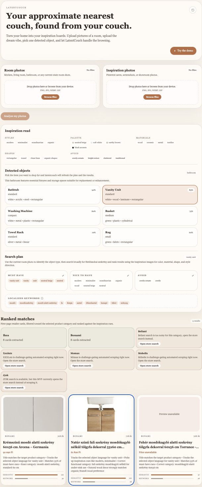

# latentcouch

Your approximate nearest couch, found from your couch.

`latentcouch` is a practical furniture-shopping helper. It takes room photos plus inspiration photos, extracts shoppable furniture cues, searches a small set of retailers with Playwright, and ranks first-page product cards that best match the vibe.



## Live demo

The deployed app ships with a **"Try the demo"** button that loads a captured session
(room analysis → inspiration read → search plan → ranked products) entirely client-side —
no API key, no scraping, instant. Live scraping of the retailers uses Playwright and only
runs locally (see below); on a serverless host the search step degrades gracefully to the
search plan plus per-store status.

## Stack

- Next.js App Router
- TypeScript
- Tailwind CSS
- OpenAI Responses API
- Zod
- Playwright

## Install

If Node.js and pnpm are already available on your machine:

```bash
pnpm install
pnpm exec playwright install chromium
cp .env.example .env.local
pnpm dev
```

```bash
OPENAI_API_KEY=your_key_here
OPENAI_MODEL=gpt-4.1-mini
PLAYWRIGHT_HEADLESS=true
```

## Package dependencies

Runtime:

- `next`
- `react`
- `react-dom`
- `openai`
- `zod`
- `playwright`
- `clsx`

Dev:

- `typescript`
- `tailwindcss`
- `@tailwindcss/postcss`
- `eslint`
- `eslint-config-next`
- `@types/node`
- `@types/react`
- `@types/react-dom`

Equivalent install commands:

```bash
pnpm add next react react-dom openai zod playwright clsx
pnpm add -D typescript tailwindcss @tailwindcss/postcss eslint eslint-config-next @types/node @types/react @types/react-dom
```

## Deploying (Vercel)

The app deploys as a standard Next.js project. The demo path is fully client-side, so no
runtime secrets are required just to show it off; add `OPENAI_API_KEY` only if you want the
live analysis routes to work in production.

1. Push to GitHub and import the repo in the Vercel dashboard (framework auto-detected).
2. Optional env vars: `OPENAI_API_KEY` (live analysis), and
   `PLAYWRIGHT_SKIP_BROWSER_DOWNLOAD=1` at build time to skip the browser download during
   install (scraping can't run on serverless anyway; it degrades gracefully).
3. Deploy. The **"Try the demo"** button works immediately.

Live retailer scraping (Playwright/Chromium) only runs locally or on a container host with
a real browser; on Vercel the search step returns the plan plus per-store "couldn't fetch"
statuses rather than erroring.

## Regenerating the demo fixture

The demo loads `lib/demo/fixture.json`. To replace the seed data with a real, high-fidelity
captured session:

1. Locally, set `NEXT_PUBLIC_ENABLE_DEMO_CAPTURE=1` in `.env.local` and run `pnpm dev`.
2. Run one real session (upload room + inspiration photos, pick an object, let it scrape).
3. Click **"⬇ Save demo fixture"** (appears once results load) and save the download over
   `lib/demo/fixture.json`.
4. Commit and push — Vercel redeploys automatically.

## Folder tree

```text
latentcouch/
├─ .env.example
├─ README.md
├─ app/
│  ├─ api/
│  │  ├─ analyze-room/route.ts
│  │  ├─ analyze-inspiration/route.ts
│  │  ├─ plan-search/route.ts
│  │  └─ search-products/route.ts
│  ├─ globals.css
│  ├─ layout.tsx
│  └─ page.tsx
├─ components/
│  ├─ image-preview-list.tsx
│  ├─ inspiration-summary.tsx
│  ├─ object-selector.tsx
│  ├─ product-card.tsx
│  ├─ results-grid.tsx
│  ├─ search-plan-card.tsx
│  ├─ status-banner.tsx
│  ├─ store-status-list.tsx
│  └─ upload-zone.tsx
├─ lib/
│  ├─ types.ts
│  ├─ utils.ts
│  ├─ openai/
│  │  ├─ analyze-inspiration.ts
│  │  ├─ analyze-room.ts
│  │  ├─ client.ts
│  │  └─ plan-search.ts
│  ├─ ranking/
│  │  └─ rank-candidates.ts
│  └─ retailers/
│     ├─ beliani.ts
│     ├─ bonami.ts
│     ├─ ikea.ts
│     ├─ index.ts
│     ├─ mobelix.ts
│     ├─ momax.ts
│     ├─ shared.ts
│     ├─ types.ts
│     └─ xxxlutz.ts
├─ next.config.ts
├─ package.json
├─ postcss.config.mjs
└─ tsconfig.json
```

## Architecture

The main user flow stays intentionally linear:

1. Upload room images and inspiration images in `app/page.tsx`.
2. POST room images to `/api/analyze-room`.
3. POST inspiration images to `/api/analyze-inspiration`.
4. Show detected objects as selectable cards.
5. On object selection, POST to `/api/plan-search`.
6. POST the resulting search plan to `/api/search-products`.
7. Run retailer adapters with Playwright.
8. Rank product candidates.
9. Render top matches in a grid.

## Schemas

Implemented in [`lib/types.ts`](lib/types.ts):

- `RoomObjectsSchema`
- `InspirationSchema`
- `SearchPlanSchema`
- `ProductCandidateSchema`

These back both API validation and OpenAI structured responses.

## Retailer adapter notes

Each retailer adapter implements the same interface in [`lib/retailers/types.ts`](lib/retailers/types.ts).

The reusable scraping logic lives in [`lib/retailers/shared.ts`](lib/retailers/shared.ts).

Currently:

- `IKEA`, `Bonami`, and `Beliani` are the strongest first-pass adapters
- `XXXLutz`, `Mömax`, and `Möbelix` are scaffolded with the same generic extraction path
- selectors are intentionally isolated with TODO-friendly config points because store markup can change